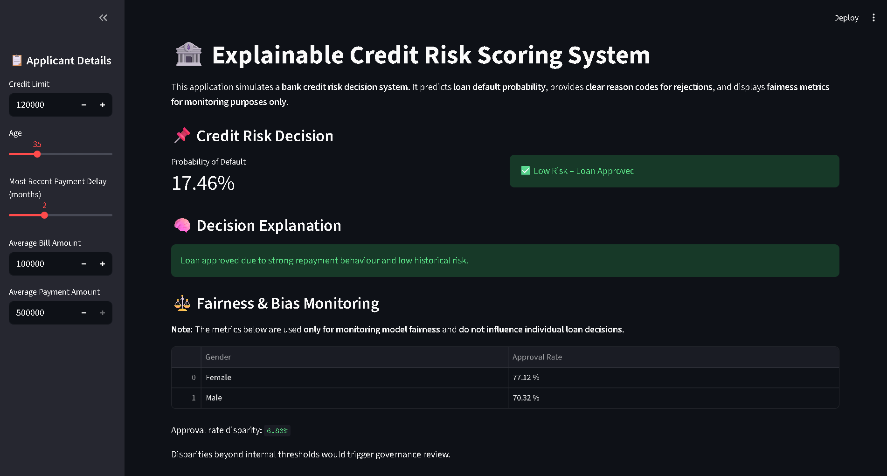
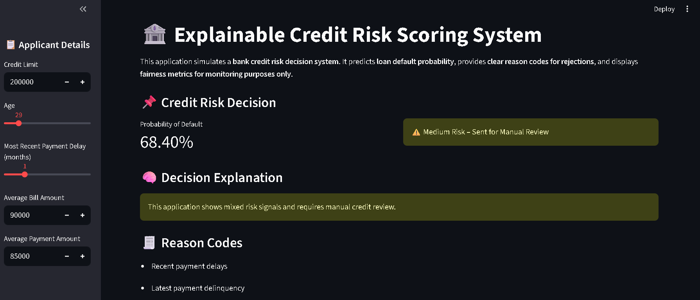
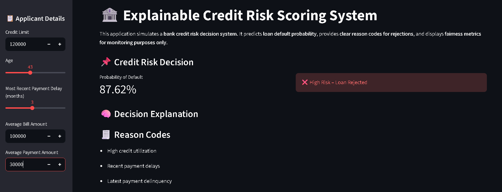
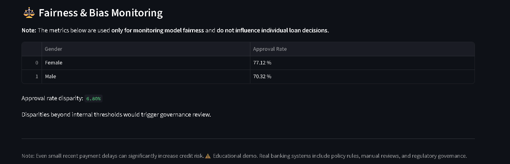
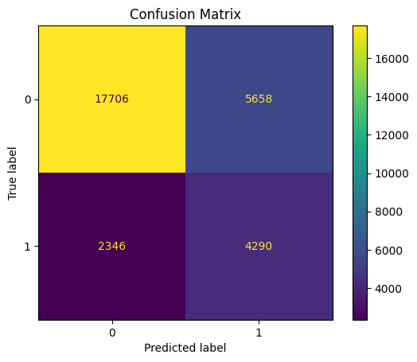
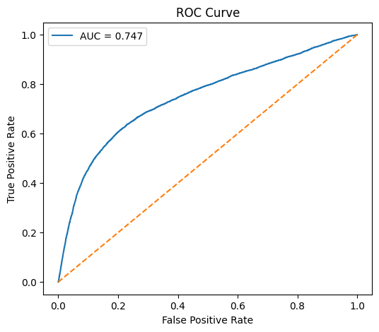
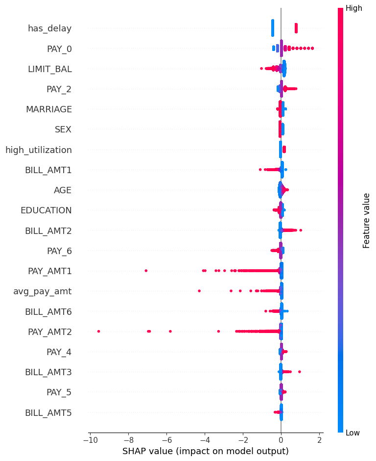
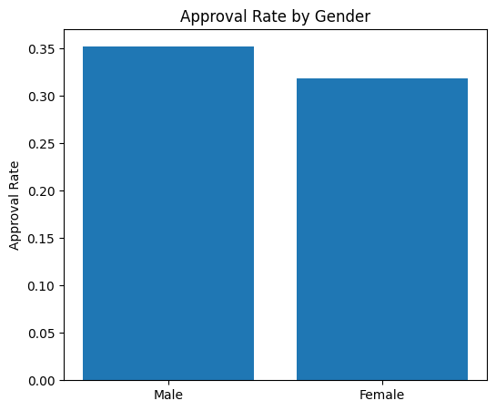

# 🏦 Explainable Credit Risk Scoring & Approval System

An end-to-end AI-powered credit risk intelligence platform designed to simulate real-world banking and NBFC loan decision workflows using explainable machine learning, fairness monitoring, and interactive risk analytics.

This project predicts loan default probability, generates business-friendly approval decisions, explains model behavior using SHAP, and monitors fairness metrics for responsible AI governance.

---

# 🚀 Project Overview

Modern banking systems require more than just prediction accuracy.

Financial institutions must ensure:

* transparent decision-making
* explainable AI outputs
* fairness monitoring
* governance compliance
* operational risk control
* customer trust

This project demonstrates how AI can support:

* loan approval automation
* credit risk intelligence
* manual review prioritization
* explainable lending decisions
* fairness & bias monitoring
* responsible AI governance

---

# 🧠 Core Capabilities

* Predict probability of loan default
* Automate credit approval workflows
* Generate business-friendly decision explanations
* Monitor fairness across demographic groups
* Provide explainable AI reasoning using SHAP
* Simulate enterprise-grade credit risk systems
* Support governance and compliance visibility

---

# 📸 Dashboard Preview

## ✅ Loan Approval Dashboard

Shows a low-risk applicant automatically approved by the AI system.



---

## ⚠️ Manual Review Workflow

Displays a medium-risk customer routed for analyst review.



---

## ❌ High-Risk Rejection Analysis

Shows a rejected applicant with transparent reason codes.



---

## ⚖️ Fairness & Bias Monitoring

Approval-rate parity analysis for responsible AI governance.



---

# 🏦 Business Problem

Banks and fintech lenders constantly balance:

* growth
* customer acquisition
* portfolio quality
* credit risk
* regulatory compliance

Approving risky borrowers increases financial losses.

Rejecting too many safe borrowers reduces revenue growth.

This system helps answer:

* Should this loan be approved?
* Should it be sent for manual review?
* Why was this decision made?
* Is the model behaving fairly?
* Are governance thresholds being violated?

---

# ⚙️ Platform Features

## 🤖 AI Credit Risk Engine

* Logistic Regression risk prediction
* probability of default estimation
* customer-level risk scoring
* threshold-based decisioning
* regulator-friendly interpretable modeling

---

## 📌 Decision Intelligence System

### ✅ Auto Approve

Low-risk applicants are automatically approved.

### ⚠️ Manual Review

Medium-risk applications are routed to analysts.

### ❌ Auto Reject

High-risk applicants are rejected with transparent reason codes.

---

## 🧠 Explainable AI (XAI)

* SHAP explainability integration
* feature contribution analysis
* adverse action reasoning
* interpretable model behavior
* transparent AI decision support

---

## ⚖️ Fairness & Bias Monitoring

* approval-rate parity analysis
* gender fairness comparison
* governance threshold monitoring
* responsible AI auditing
* ethical AI system simulation

---

## 📊 Interactive Streamlit Dashboard

The dashboard includes:

* applicant simulation controls
* approval probability estimation
* manual review workflows
* rejection explanation engine
* fairness monitoring analytics
* real-time decision intelligence

---

# 📈 Saved Model Evaluation Visuals

## 📉 Confusion Matrix



---

## 📈 ROC Curve



---

## 🔍 SHAP Explainability Summary



---

## ⚖️ Fairness Comparison Analysis



---

# 📊 Model Performance Metrics

Evaluation metrics used:

* Accuracy
* Precision
* Recall
* F1-Score
* ROC-AUC

The system prioritizes:

* interpretability
* governance readiness
* explainability
* operational usability
* responsible AI principles

---

# 💼 Business Impact Simulation

This platform demonstrates how AI can help financial institutions:

- Reduce high-risk loan approvals
- Improve portfolio quality
- Accelerate lending operations
- Increase transparency in AI decisions
- Support compliance and governance teams
- Enhance customer trust through explainability
- Assist analysts with manual review prioritization

---

# 🛠️ Tech Stack

## Programming & Frameworks

* Python
* Streamlit

## Machine Learning

* Scikit-learn
* Logistic Regression

## Explainable AI

* SHAP

## Fairness & Governance

* Fairlearn

## Data Analytics

* Pandas
* NumPy

## Visualization

* Matplotlib

---

# 🏗️ Enterprise AI Workflow

The platform simulates a real-world banking AI risk pipeline:

1. Applicant financial data is collected
2. Features are engineered for credit risk modeling
3. AI model predicts probability of default
4. Decision engine classifies:
   - Approved
   - Manual Review
   - Rejected
5. SHAP explainability generates transparent reason codes
6. Fairness monitoring evaluates governance metrics
7. Results are visualized through the Streamlit dashboard

---

# 📂 Project Structure

```bash
Explainable-Credit-Risk-Scoring/
│
├── data/
│   ├── raw/
│   │   └── default of credit card clients.xls
│   │
│   └── processed/
│       ├── cleaned_data.csv
│       └── features.csv
│
├── dashboard/
│   └── app.py
│
├── src/
│   ├── data_preprocessing.py
│   ├── feature_engineering.py
│   ├── train_model.py
│   ├── evaluate_model.py
│   ├── explain_model.py
│   └── fairness_analysis.py
│
├── models/
│   ├── credit_model.pkl
│   ├── scaler.pkl
│   └── feature_columns.pkl
│
├── outputs/
│   └── visuals/
│       ├── confusion_matrix.png
│       ├── roc_curve.png
│       ├── shap_summary.png
│       └── fairness_comparison.png
│
├── screenshots/
│   ├── loan_approval_dashboard.png
│   ├── manual_review_case.png
│   ├── loan_rejection_analysis.png
│   └── fairness_monitoring.png
│
├── reports/
│   ├── Model_Performance.md
│   ├── Explainability.md
│   └── Fairness_Bias.md
│
├── requirements.txt
├── .gitignore
└── README.md
```

---

# 📊 Financial Risk Dataset

## UCI Credit Default Dataset

This project uses the well-known credit default dataset widely used in banking risk analytics and machine learning research.

### Dataset Highlights

* Credit card customer records
* repayment history
* bill statement information
* payment behavior analytics
* demographic variables
* default classification target

### Prediction Target

* `1` → Default Risk
* `0` → Non-Default

---

# ▶️ Installation & Setup

## 1️⃣ Clone Repository

```bash
git clone https://github.com/girishshenoy16/Explainable-Credit-Risk-Scoring.git

cd Explainable-Credit-Risk-Scoring
```

---

## 2️⃣ Create Virtual Environment

### Windows

```bash
python -m venv venv
venv\Scripts\activate
```

### Mac/Linux

```bash
python3 -m venv venv
source venv/bin/activate
```

---

## 3️⃣ Install Dependencies

```bash
pip install --upgrade pip
pip install -r requirements.txt
```

---

## 4️⃣ Run ML Pipeline

```bash
python src/data_preprocessing.py
python src/feature_engineering.py
python src/train_model.py
python src/evaluate_model.py
python src/explain_model.py
python src/fairness_analysis.py
```

---

## 5️⃣ Run Streamlit Dashboard

```bash
streamlit run dashboard/app.py
```

---

# 📁 Outputs Generated

The platform generates:

* approval probability analysis
* loan decision outputs
* fairness comparison reports
* SHAP explainability visuals
* confusion matrices
* ROC curve analytics
* governance monitoring outputs

---

# ⚖️ Responsible AI Considerations

This project demonstrates responsible AI concepts commonly used in regulated financial systems:

- Explainable AI for transparent lending decisions
- Fairness monitoring across demographic groups
- Human-in-the-loop manual review workflows
- Governance-oriented risk thresholds
- Interpretable machine learning models
- Bias awareness and monitoring simulation

Note:
This project is an educational simulation and does not represent a production banking system.

---

# 🌍 Why This Project Matters

Modern AI systems in banking cannot function as “black boxes.”

Financial institutions increasingly require:

* explainable AI
* responsible lending systems
* fairness auditing
* governance monitoring
* transparent decision intelligence

This project demonstrates how AI can move beyond prediction into:

* operational decision systems
* explainable banking intelligence
* ethical AI governance
* enterprise-grade financial analytics

---

# 👨‍💻 Author

Girish Shenoy

Aspiring AI & Data Analytics Professional focused on:

* Explainable AI
* Financial Analytics
* Risk Intelligence
* AI Governance
* Machine Learning Systems
* Decision Intelligence Platforms

---

# 🙌 Acknowledgements

Guided by Umesh Yadav Sir under EDC, IIT Delhi in association with the Indian Institute of Placement.